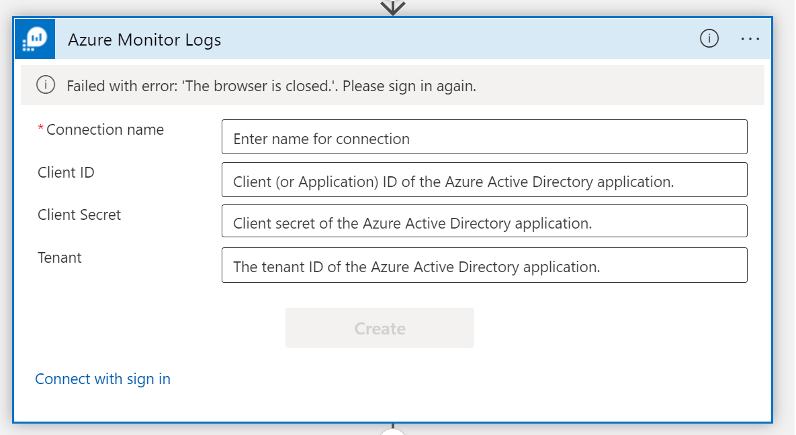
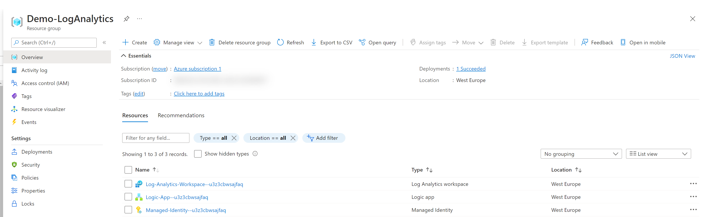
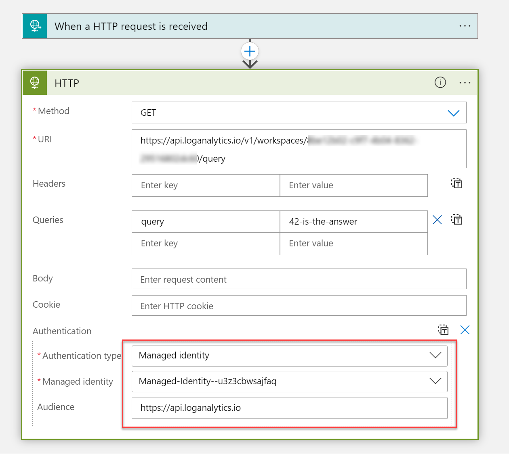
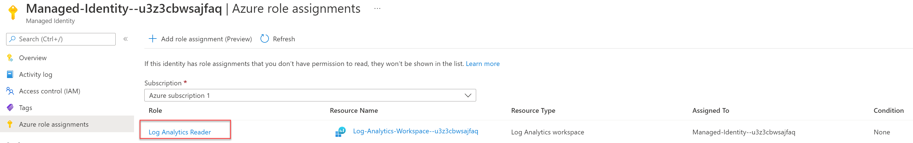
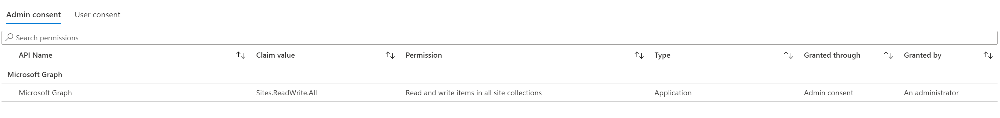

# AzureLogAnalytics 💙 Managed Identity

Azure Log Analytics is super powerful to collect data and give you insights on what's going on with your apps and resources. There is even an Azure Monitor Logs connector for Logic Apps.

⚡ Very unfortunately, the connector doesn't support authentication with a Managed Identity - which means that you'd need either rto be a signed-in user  or use an app registration, which comes with its own challenges on secret handling.

> 💡 Azure Log Analytics REST API to the rescue!

We can call the [Azure Log Analytics REST API](https://docs.microsoft.com/en-us/rest/api/loganalytics/) from Logic Apps with the generic HTTP action - and authenticate with a Managed Identity. For this example, I chose a user-assigned Managed Identity, so that you can reuse it across resources, but of course you can go with a system-assigned Managed Identity as well.

I wanted to create a sample on how to create a Logic App that queries Log Analytics with a user-assigned Managed Identity that has the [Log Analytics Reader](https://docs.microsoft.com/en-us/azure/role-based-access-control/built-in-roles#log-analytics-reader) assigned. The Managed Identity also has Microsoft Graph permissions with scope `Sites.ReadWrite.All` assigned in order to create new items in a SharerPoint list about the result of a query of Azure Monitor logs. That could be beneficial for users who don't have access to the logs but should be notified or similar.

## Deployment

1. Fork and clone this repository
1. Browse to the root folder in your clone
1. Connect to the Azure subscription that you want this to run in
1. Run the `deploy.ps1` script, it will create the resource group, the resources, assign the `Log Analytics` role and Graph API `Sites.ReadWrite.All` permissions to the Managed Identity
1. You will be prompted to provide
   - a location
   - a Resource group name
   - the `siteID` of the site your list lives in
   - the `listId` of the list in which new rows shall be created

### Validate deployment

1. Check in the Azure Portal after you read the success-message `Resources deployed successfully, role assigned`

   - Resource group
   - Logic App
   - Azure Log Workspace
   - Managed Identity

1. In the Logic App, the Authentication works with the Managed Identity

1. Our Managed Identity has the `Log Analytics Reader` role assigned

1. Our Managed Identity has the `SitesReadWrite.All` permission assigned

💡 Please make sure that you insert a query into the Logic app that makes sense depending on your scenario. Also adjust the `body` of the `Create list item` action to match your SharePoint list.

## Questions?

If you have questions, want to use this, make it better - please do! Find me either on [twitter](https://twitter.com/LuiseFreese) or on [GitHub](https://github.com/luisefreese)

*sharing is caring*
